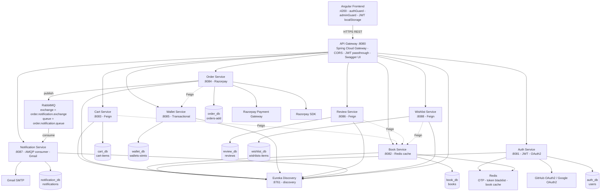

# 📚 BookNest Microservices Architecture

## 🏗️ System Overview

BookNest is a scalable microservices-based online bookstore platform built using Spring Boot, Spring Cloud, Angular, RabbitMQ, Redis, and MySQL.

The system follows:
- Database-per-service pattern
- Event-driven communication using RabbitMQ
- JWT-based authentication & authorization
- API Gateway routing
- Service discovery using Eureka
- Distributed caching using Redis

---

# 🧩 Architecture Diagram

---

# ⚙️ Tech Stack

## Frontend
- Angular
- Bootstrap
- JWT Authentication
- Route Guards

## Backend
- Spring Boot
- Spring Security
- Spring Cloud Gateway
- Eureka Discovery Server
- OpenFeign

## Databases & Cache
- MySQL
- Redis

## Messaging
- RabbitMQ

## External Integrations
- Razorpay Payment Gateway
- Gmail SMTP
- OAuth2 Login

---

# 🔐 Security Features

- JWT Authentication
- Role-based Authorization
- Token Blacklisting using Redis
- OAuth2 Login Support
- API Gateway Authentication Filter

---

# 🚀 Microservices

| Service | Port | Responsibility |
|---|---|---|
| API Gateway | 8080 | Routing & Security |
| Eureka Server | 8761 | Service Discovery |
| Auth Service | 8081 | Authentication & JWT |
| Book Service | 8082 | Book Management |
| Cart Service | 8083 | Shopping Cart |
| Order Service | 8084 | Orders & Payments |
| Wallet Service | 8085 | Wallet Transactions |
| Review Service | 8086 | Reviews & Ratings |
| Notification Service | 8087 | Email Notifications |
| Wishlist Service | 8088 | Wishlist Management |

---

# 📦 Key Architecture Patterns

## API Gateway Pattern
All client requests pass through Spring Cloud Gateway.

## Database Per Service
Each microservice maintains its own isolated MySQL schema.

## Event-Driven Architecture
RabbitMQ enables asynchronous communication between services.

## Distributed Caching
Redis is used for:
- OTP storage
- JWT blacklist
- Book caching

## Service Discovery
Eureka dynamically manages service registration and discovery.

---

# 🔄 Order Processing Flow

1. User places order from Angular frontend
2. API Gateway routes request to Order Service
3. Order Service validates payment using Razorpay
4. Wallet Service updates transaction records
5. Order Service publishes event to RabbitMQ
6. Notification Service consumes event
7. Email confirmation sent via Gmail SMTP

---

# 🧠 Highlights

- Scalable microservices architecture
- Async communication using RabbitMQ
- Secure JWT authentication
- Redis caching for performance
- OAuth2 social login
- Clean API Gateway routing
- Independent service databases
- Production-ready backend design

---
