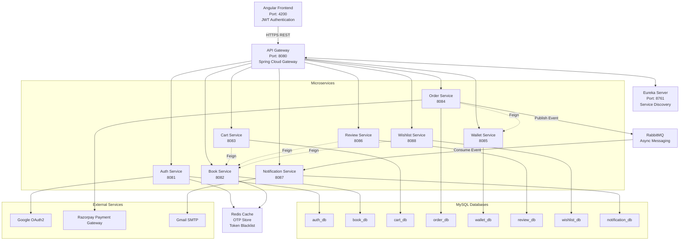

# 🏗️ BookNest Microservices Architecture

---

## 🔧 Tech Stack

- Angular
- Spring Boot
- Spring Cloud Gateway
- Eureka Discovery Server
- RabbitMQ
- Redis
- MySQL
- JWT Authentication
- Razorpay Integration
- Gmail SMTP
- Docker

---

## ✨ Key Features

- Microservices Architecture
- API Gateway Routing
- JWT Authentication & Authorization
- Service Discovery using Eureka
- Asynchronous Communication using RabbitMQ
- Redis Caching & Token Blacklisting
- Razorpay Payment Integration
- Wishlist, Cart & Wallet Modules
- Email Notification System
- Independent Databases per Service
