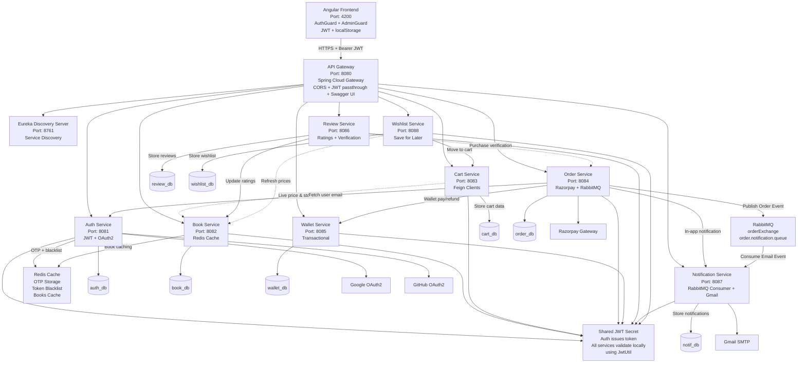
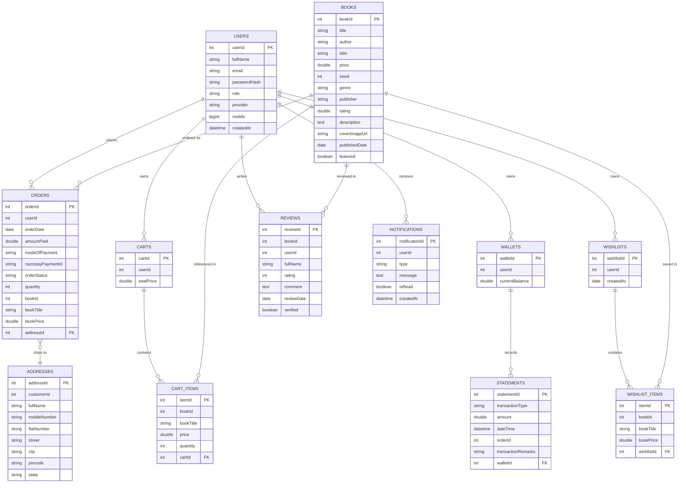

## 🏗️ BookNest Microservices Architecture

```mermaid
flowchart TB

%% =====================================================
%% FRONTEND
%% =====================================================

FE[Angular Frontend<br/>Port: 4200<br/>AuthGuard + AdminGuard<br/>JWT + localStorage]

%% =====================================================
%% API GATEWAY & DISCOVERY
%% =====================================================

GW[API Gateway<br/>Port: 8080<br/>Spring Cloud Gateway<br/>CORS + JWT passthrough + Swagger UI]

EU[Eureka Discovery Server<br/>Port: 8761<br/>Service Discovery]

FE -->|HTTPS + Bearer JWT| GW
GW --> EU

%% =====================================================
%% JWT SHARED INFRASTRUCTURE
%% =====================================================

JWT[Shared JWT Secret<br/>Auth issues token<br/>All services validate locally<br/>using JwtUtil]

AUTH --> JWT
BOOK --> JWT
CART --> JWT
ORDER --> JWT
WALLET --> JWT
REVIEW --> JWT
NOTIF --> JWT
WISHLIST --> JWT

%% =====================================================
%% MICROSERVICES
%% =====================================================

AUTH[Auth Service<br/>Port: 8081<br/>JWT + OAuth2]

BOOK[Book Service<br/>Port: 8082<br/>Redis Cache]

CART[Cart Service<br/>Port: 8083<br/>Feign Clients]

ORDER[Order Service<br/>Port: 8084<br/>Razorpay + RabbitMQ]

WALLET[Wallet Service<br/>Port: 8085<br/>Transactional]

REVIEW[Review Service<br/>Port: 8086<br/>Ratings + Verification]

NOTIF[Notification Service<br/>Port: 8087<br/>RabbitMQ Consumer + Gmail]

WISHLIST[Wishlist Service<br/>Port: 8088<br/>Save for Later]

%% =====================================================
%% API GATEWAY ROUTING
%% =====================================================

GW --> AUTH
GW --> BOOK
GW --> CART
GW --> ORDER
GW --> WALLET
GW --> REVIEW
GW --> NOTIF
GW --> WISHLIST

%% =====================================================
%% INTER-SERVICE FEIGN COMMUNICATION
%% =====================================================

CART -.->|Live price & stock| BOOK

ORDER -->|Fetch user email| AUTH
ORDER -->|Wallet pay/refund| WALLET
ORDER -->|In-app notification| NOTIF

REVIEW -.->|Purchase verification| ORDER
REVIEW -->|Update ratings| BOOK

WISHLIST -.->|Refresh prices| BOOK
WISHLIST -->|Move to cart| CART

%% =====================================================
%% MESSAGE BROKER
%% =====================================================

RMQ[RabbitMQ<br/>orderExchange<br/>order.notification.queue]

ORDER -->|Publish Order Event| RMQ
RMQ -->|Consume Email Event| NOTIF

%% =====================================================
%% REDIS CACHE
%% =====================================================

REDIS[Redis Cache<br/>OTP Storage<br/>Token Blacklist<br/>Books Cache]

AUTH -->|OTP + blacklist| REDIS
BOOK -->|Book caching| REDIS

%% =====================================================
%% DATABASES
%% =====================================================

ADB[(auth_db)]
BDB[(book_db)]
CDB[(cart_db)]
ODB[(order_db)]
WDB[(wallet_db)]
RDB[(review_db)]
NDB[(notif_db)]
WLDB[(wishlist_db)]

AUTH --> ADB
BOOK --> BDB

CART -->|Store cart data| CDB

ORDER --> ODB

WALLET --> WDB

REVIEW -->|Store reviews| RDB

NOTIF -->|Store notifications| NDB

WISHLIST -->|Store wishlist| WLDB

%% =====================================================
%% EXTERNAL SERVICES
%% =====================================================

GOOGLE[Google OAuth2]
GITHUB[GitHub OAuth2]
RAZOR[Razorpay Gateway]
MAIL[Gmail SMTP]

AUTH --> GOOGLE
AUTH --> GITHUB

ORDER --> RAZOR

NOTIF --> MAIL
```
---

## 📌 Entity Relationship Diagram (ERD)

```mermaid
erDiagram

    USERS {
        int userId PK
        string fullName
        string email
        string passwordHash
        string role
        string provider
        bigint mobile
        datetime createdAt
    }

    BOOKS {
        int bookId PK
        string title
        string author
        string isbn
        double price
        int stock
        string genre
        string publisher
        double rating
        text description
        string coverImageUrl
        date publishedDate
        boolean featured
    }

    CARTS {
        int cartId PK
        int userId
        double totalPrice
    }

    CART_ITEMS {
        int itemId PK
        int bookId
        string bookTitle
        double price
        int quantity
        int cartId FK
    }

    ORDERS {
        int orderId PK
        int userId
        date orderDate
        double amountPaid
        string modeOfPayment
        string razorpayPaymentId
        string orderStatus
        int quantity
        int bookId
        string bookTitle
        double bookPrice
        int addressId FK
    }

    ADDRESSES {
        int addressId PK
        int customerId
        string fullName
        string mobileNumber
        string flatNumber
        string street
        string city
        string pincode
        string state
    }

    WALLETS {
        int walletId PK
        int userId
        double currentBalance
    }

    STATEMENTS {
        int statementId PK
        string transactionType
        double amount
        datetime dateTime
        int orderId
        string transactionRemarks
        int walletId FK
    }

    REVIEWS {
        int reviewId PK
        int bookId
        int userId
        string fullName
        int rating
        text comment
        date reviewDate
        boolean verified
    }

    NOTIFICATIONS {
        int notificationId PK
        int userId
        string type
        text message
        boolean isRead
        datetime createdAt
    }

    WISHLISTS {
        int wishlistId PK
        int userId
        date createdAt
    }

    WISHLIST_ITEMS {
        int itemId PK
        int bookId
        string bookTitle
        double bookPrice
        int wishlistId FK
    }

    CARTS ||--o{ CART_ITEMS : contains
    WALLETS ||--o{ STATEMENTS : records
    WISHLISTS ||--o{ WISHLIST_ITEMS : contains
    ORDERS }o--|| ADDRESSES : "ships to"
    USERS ||--o{ ORDERS : places
    USERS ||--o{ CARTS : owns
    USERS ||--o{ WALLETS : owns
    USERS ||--o{ REVIEWS : writes
    USERS ||--o{ NOTIFICATIONS : receives
    USERS ||--o{ WISHLISTS : owns
    BOOKS ||--o{ CART_ITEMS : "referenced in"
    BOOKS ||--o{ ORDERS : "ordered as"
    BOOKS ||--o{ REVIEWS : "reviewed in"
    BOOKS ||--o{ WISHLIST_ITEMS : "saved in"
```
