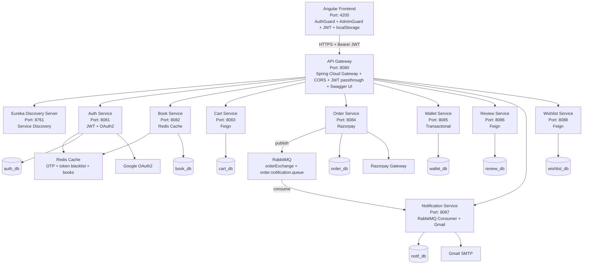

## 🏗️ BookNest Microservices Architecture

```mermaid
flowchart TB

%% =========================
%% FRONTEND
%% =========================

FE[Angular Frontend<br/>Port: 4200<br/>AuthGuard + AdminGuard + JWT + localStorage]

%% =========================
%% GATEWAY & DISCOVERY
%% =========================

GW[API Gateway<br/>Port: 8080<br/>Spring Cloud Gateway + CORS + JWT passthrough + Swagger UI]

EU[Eureka Discovery Server<br/>Port: 8761<br/>Service Discovery]

FE -->|HTTPS + Bearer JWT| GW
GW --> EU

%% =========================
%% MICROSERVICES
%% =========================

AUTH[Auth Service<br/>Port: 8081<br/>JWT + OAuth2]
BOOK[Book Service<br/>Port: 8082<br/>Redis Cache]
CART[Cart Service<br/>Port: 8083<br/>Feign]
ORDER[Order Service<br/>Port: 8084<br/>Razorpay]
WALLET[Wallet Service<br/>Port: 8085<br/>Transactional]
REVIEW[Review Service<br/>Port: 8086<br/>Feign]
NOTIF[Notification Service<br/>Port: 8087<br/>RabbitMQ Consumer + Gmail]
WISHLIST[Wishlist Service<br/>Port: 8088<br/>Feign]

GW --> AUTH
GW --> BOOK
GW --> CART
GW --> ORDER
GW --> WALLET
GW --> REVIEW
GW --> NOTIF
GW --> WISHLIST

%% =========================
%% MESSAGE BROKER
%% =========================

RMQ[RabbitMQ<br/>orderExchange + order.notification.queue]

ORDER -->|publish| RMQ
RMQ -->|consume| NOTIF

%% =========================
%% CACHE
%% =========================

REDIS[Redis Cache<br/>OTP + token blacklist + books]

AUTH --> REDIS
BOOK --> REDIS

%% =========================
%% DATABASES
%% =========================

ADB[(auth_db)]
BDB[(book_db)]
CDB[(cart_db)]
ODB[(order_db)]
WDB[(wallet_db)]
RDB[(review_db)]
NDB[(notif_db)]
WLDB[(wishlist_db)]

AUTH --> ADB
BOOK --> BDB
CART --> CDB
ORDER --> ODB
WALLET --> WDB
REVIEW --> RDB
NOTIF --> NDB
WISHLIST --> WLDB

%% =========================
%% EXTERNAL SERVICES
%% =========================

GOOGLE[Google OAuth2]
RAZOR[Razorpay Gateway]
MAIL[Gmail SMTP]

AUTH --> GOOGLE
ORDER --> RAZOR
NOTIF --> MAIL
```
