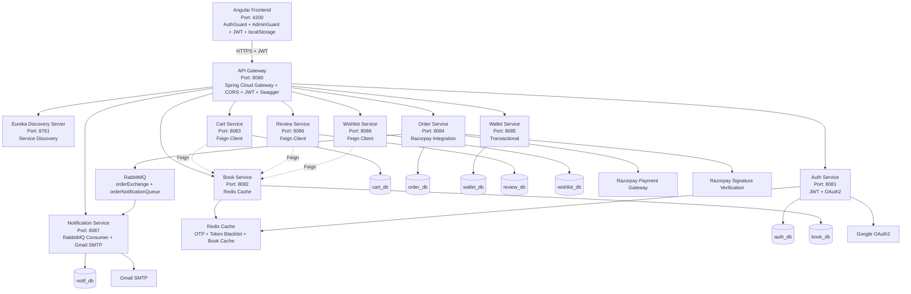

# 📖 Architecture Diagram

```mermaid
flowchart TB

%% =========================
%% FRONTEND
%% =========================

FE[Angular Frontend<br/>Port: 4200<br/>AuthGuard + AdminGuard + JWT + localStorage]

%% =========================
%% GATEWAY & DISCOVERY
%% =========================

GW[API Gateway<br/>Port: 8080<br/>Spring Cloud Gateway + CORS + JWT + Swagger]

EU[Eureka Discovery Server<br/>Port: 8761<br/>Service Discovery]

%% =========================
%% MICROSERVICES
%% =========================

AUTH[Auth Service<br/>Port: 8081<br/>JWT + OAuth2]

BOOK[Book Service<br/>Port: 8082<br/>Redis Cache]

CART[Cart Service<br/>Port: 8083<br/>Feign Client]

ORDER[Order Service<br/>Port: 8084<br/>Razorpay Integration]

WALLET[Wallet Service<br/>Port: 8085<br/>Transactional]

REVIEW[Review Service<br/>Port: 8086<br/>Feign Client]

NOTIF[Notification Service<br/>Port: 8087<br/>RabbitMQ Consumer + Gmail SMTP]

WISHLIST[Wishlist Service<br/>Port: 8088<br/>Feign Client]

%% =========================
%% MESSAGE BROKER & CACHE
%% =========================

MQ[RabbitMQ<br/>orderExchange + orderNotificationQueue]

REDIS[Redis Cache<br/>OTP + Token Blacklist + Book Cache]

%% =========================
%% DATABASES
%% =========================

AUTHDB[(auth_db)]
BOOKDB[(book_db)]
CARTDB[(cart_db)]
ORDERDB[(order_db)]
WALLETDB[(wallet_db)]
REVIEWDB[(review_db)]
NOTIFDB[(notif_db)]
WISHLISTDB[(wishlist_db)]

%% =========================
%% EXTERNAL SERVICES
%% =========================

GOOGLE[Google OAuth2]
RAZORPAY[Razorpay Payment Gateway]
SMTP[Gmail SMTP]
RAZORPAYSDK[Razorpay Signature Verification]

%% =========================
%% CONNECTIONS
%% =========================

FE -->|HTTPS + JWT| GW

GW --> EU

GW --> AUTH
GW --> BOOK
GW --> CART
GW --> ORDER
GW --> WALLET
GW --> REVIEW
GW --> NOTIF
GW --> WISHLIST

AUTH --> AUTHDB
BOOK --> BOOKDB
CART --> CARTDB
ORDER --> ORDERDB
WALLET --> WALLETDB
REVIEW --> REVIEWDB
NOTIF --> NOTIFDB
WISHLIST --> WISHLISTDB

BOOK --> REDIS
AUTH --> REDIS

ORDER --> MQ
MQ --> NOTIF

AUTH --> GOOGLE
ORDER --> RAZORPAY
NOTIF --> SMTP
ORDER --> RAZORPAYSDK

CART -.Feign.-> BOOK
REVIEW -.Feign.-> BOOK
WISHLIST -.Feign.-> BOOK
```
