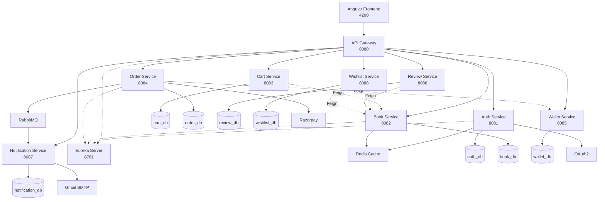

```mermaid
flowchart TB

%% ================= FRONTEND =================
FE[Angular Frontend<br/>4200]

%% ================= GATEWAY =================
GW[API Gateway<br/>8080]

%% ================= CORE SERVICES =================
AUTH[Auth Service<br/>8081]
BOOK[Book Service<br/>8082]
CART[Cart Service<br/>8083]
ORDER[Order Service<br/>8084]
WALLET[Wallet Service<br/>8085]
REVIEW[Review Service<br/>8086]
NOTIF[Notification Service<br/>8087]
WISH[Wishlist Service<br/>8088]

%% ================= INFRA =================
EU[Eureka Server<br/>8761]
RABBIT[RabbitMQ]
REDIS[Redis Cache]

%% ================= DATABASES =================
AUTHDB[(auth_db)]
BOOKDB[(book_db)]
CARTDB[(cart_db)]
ORDERDB[(order_db)]
WALLETDB[(wallet_db)]
REVIEWDB[(review_db)]
WISHDB[(wishlist_db)]
NOTIFDB[(notification_db)]

%% ================= EXTERNAL =================
GOOGLE[OAuth2]
RAZOR[Razorpay]
SMTP[Gmail SMTP]

%% ================= MAIN FLOW =================

FE --> GW

GW --> AUTH
GW --> BOOK
GW --> CART
GW --> ORDER
GW --> WALLET
GW --> REVIEW
GW --> NOTIF
GW --> WISH

%% ================= SERVICE DISCOVERY =================

GW -.-> EU
AUTH -.-> EU
BOOK -.-> EU
ORDER -.-> EU

%% ================= FEIGN =================

CART -. Feign .-> BOOK
REVIEW -. Feign .-> BOOK
WISH -. Feign .-> BOOK
ORDER -. Feign .-> WALLET

%% ================= MESSAGING =================

ORDER --> RABBIT
RABBIT --> NOTIF

%% ================= REDIS =================

AUTH --> REDIS
BOOK --> REDIS

%% ================= DATABASES =================

AUTH --> AUTHDB
BOOK --> BOOKDB
CART --> CARTDB
ORDER --> ORDERDB
WALLET --> WALLETDB
REVIEW --> REVIEWDB
WISH --> WISHDB
NOTIF --> NOTIFDB

%% ================= EXTERNAL SERVICES =================

AUTH --> GOOGLE
ORDER --> RAZOR
NOTIF --> SMTP
```
