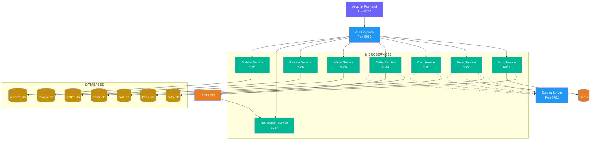

```mermaid
flowchart TB

%% FRONTEND

FE[Angular Frontend<br>Port 4200]

%% GATEWAY

GW[API Gateway<br>Port 8080]

%% DISCOVERY

EU[Eureka Server<br>Port 8761]

%% SERVICES

subgraph MICROSERVICES

AUTH[Auth Service<br>8081]
BOOK[Book Service<br>8082]
CART[Cart Service<br>8083]
ORDER[Order Service<br>8084]
WALLET[Wallet Service<br>8085]
REVIEW[Review Service<br>8086]
NOTIF[Notification Service<br>8087]
WISH[Wishlist Service<br>8088]

end

%% DATABASES

subgraph DATABASES

AUTHDB[(auth_db)]
BOOKDB[(book_db)]
CARTDB[(cart_db)]
ORDERDB[(order_db)]
WALLETDB[(wallet_db)]
REVIEWDB[(review_db)]
WISHDB[(wishlist_db)]

end

%% CACHE & MQ

REDIS[(Redis)]
RABBIT[RabbitMQ]

%% FLOW

FE --> GW

GW --> AUTH
GW --> BOOK
GW --> CART
GW --> ORDER
GW --> WALLET
GW --> REVIEW
GW --> NOTIF
GW --> WISH

AUTH --> AUTHDB
BOOK --> BOOKDB
CART --> CARTDB
ORDER --> ORDERDB
WALLET --> WALLETDB
REVIEW --> REVIEWDB
WISH --> WISHDB

AUTH --> REDIS
BOOK --> REDIS

ORDER --> RABBIT
RABBIT --> NOTIF

AUTH -.-> EU
BOOK -.-> EU
CART -.-> EU
ORDER -.-> EU

%% COLORS

classDef frontend fill:#6c63ff,color:#fff
classDef gateway fill:#2196f3,color:#fff
classDef service fill:#00b894,color:#fff
classDef db fill:#c49000,color:#fff
classDef infra fill:#e67e22,color:#fff

class FE frontend
class GW,EU gateway
class AUTH,BOOK,CART,ORDER,WALLET,REVIEW,NOTIF,WISH service
class AUTHDB,BOOKDB,CARTDB,ORDERDB,WALLETDB,REVIEWDB,WISHDB db
class REDIS,RABBIT infra
```
