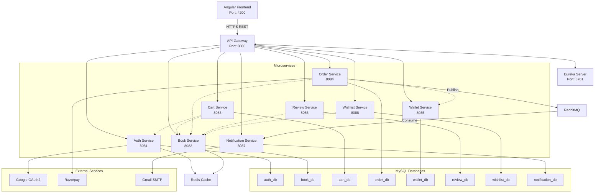

# 🏗️ BookNest Microservices Architecture

```mermaid
flowchart TB

%% FRONTEND
A["Angular Frontend<br/>Port: 4200"]

%% API GATEWAY
B["API Gateway<br/>Port: 8080"]

%% EUREKA
C["Eureka Server<br/>Port: 8761"]

A -->|HTTPS REST| B
B <--> C

%% SERVICES
subgraph SERVICES [Microservices]

D["Auth Service<br/>8081"]
E["Book Service<br/>8082"]
F["Cart Service<br/>8083"]
G["Order Service<br/>8084"]

H["Wallet Service<br/>8085"]
I["Review Service<br/>8086"]
J["Notification Service<br/>8087"]
K["Wishlist Service<br/>8088"]

end

B --> D
B --> E
B --> F
B --> G
B --> H
B --> I
B --> J
B --> K

%% INTERNAL COMMUNICATION
F -.-> E
F -.-> D
G -.-> H
G -.-> E
I -.-> E
K -.-> E

%% RABBITMQ
L["RabbitMQ"]

G -->|Publish| L
L -->|Consume| J

%% REDIS
M["Redis Cache"]

D --> M
E --> M

%% DATABASES
subgraph DATABASES [MySQL Databases]

N["auth_db"]
O["book_db"]
P["cart_db"]
Q["order_db"]

R["wallet_db"]
S["review_db"]
T["wishlist_db"]
U["notification_db"]

end

D --> N
E --> O
F --> P
G --> Q
H --> R
I --> S
K --> T
J --> U

%% EXTERNAL SERVICES
subgraph EXTERNALS [External Services]

V["Google OAuth2"]
W["Razorpay"]
X["Gmail SMTP"]

end

D --> V
G --> W
J --> X
```
