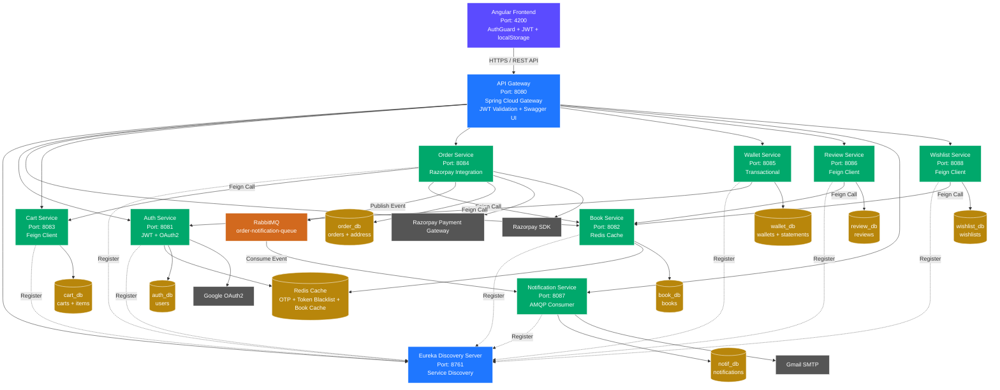

```mermaid
flowchart TB

%% =========================
%% FRONTEND
%% =========================

FE[Angular Frontend\nPort: 4200\nAuthGuard + JWT + localStorage]

%% =========================
%% GATEWAY & DISCOVERY
%% =========================

GW[API Gateway\nPort: 8080\nSpring Cloud Gateway\nJWT Validation + Swagger UI]

EU[Eureka Discovery Server\nPort: 8761\nService Discovery]

FE -->|HTTPS / REST API| GW
GW --> EU

%% =========================
%% MICROSERVICES
%% =========================

AUTH[Auth Service\nPort: 8081\nJWT + OAuth2]
BOOK[Book Service\nPort: 8082\nRedis Cache]
CART[Cart Service\nPort: 8083\nFeign Client]
ORDER[Order Service\nPort: 8084\nRazorpay Integration]
WALLET[Wallet Service\nPort: 8085\nTransactional]
REVIEW[Review Service\nPort: 8086\nFeign Client]
NOTIF[Notification Service\nPort: 8087\nAMQP Consumer]
WISHLIST[Wishlist Service\nPort: 8088\nFeign Client]

GW --> AUTH
GW --> BOOK
GW --> CART
GW --> ORDER
GW --> WALLET
GW --> REVIEW
GW --> NOTIF
GW --> WISHLIST

%% =========================
%% SERVICE DISCOVERY LINKS
%% =========================

AUTH -. Register .-> EU
BOOK -. Register .-> EU
CART -. Register .-> EU
ORDER -. Register .-> EU
WALLET -. Register .-> EU
REVIEW -. Register .-> EU
NOTIF -. Register .-> EU
WISHLIST -. Register .-> EU

%% =========================
%% FEIGN COMMUNICATION
%% =========================

ORDER -->|Feign Call| CART
ORDER -->|Feign Call| BOOK
REVIEW -->|Feign Call| BOOK
WALLET -->|Feign Call| AUTH
WISHLIST -->|Feign Call| BOOK

%% =========================
%% RABBITMQ
%% =========================

RABBIT[RabbitMQ\norder-notification-queue]

ORDER -->|Publish Event| RABBIT
RABBIT -->|Consume Event| NOTIF

%% =========================
%% REDIS
%% =========================

REDIS[(Redis Cache\nOTP + Token Blacklist + Book Cache)]

AUTH --> REDIS
BOOK --> REDIS

%% =========================
%% DATABASES
%% =========================

AUTHDB[(auth_db\nusers)]
BOOKDB[(book_db\nbooks)]
CARTDB[(cart_db\ncarts + items)]
ORDERDB[(order_db\norders + address)]
WALLETDB[(wallet_db\nwallets + statements)]
REVIEWDB[(review_db\nreviews)]
WISHLISTDB[(wishlist_db\nwishlists)]
NOTIFDB[(notif_db\nnotifications)]

AUTH --> AUTHDB
BOOK --> BOOKDB
CART --> CARTDB
ORDER --> ORDERDB
WALLET --> WALLETDB
REVIEW --> REVIEWDB
WISHLIST --> WISHLISTDB
NOTIF --> NOTIFDB

%% =========================
%% EXTERNAL SERVICES
%% =========================

GOOGLE[Google OAuth2]
RAZORPAY[Razorpay Payment Gateway]
SMTP[Gmail SMTP]
SDK[Razorpay SDK]

AUTH --> GOOGLE
ORDER --> RAZORPAY
ORDER --> SDK
NOTIF --> SMTP

%% =========================
%% STYLING
%% =========================

classDef frontend fill:#5b4bff,color:#fff,stroke:#ffffff,stroke-width:1px;
classDef gateway fill:#1f77ff,color:#fff,stroke:#ffffff,stroke-width:1px;
classDef service fill:#00a86b,color:#fff,stroke:#ffffff,stroke-width:1px;
classDef message fill:#d2691e,color:#fff,stroke:#ffffff,stroke-width:1px;
classDef datastore fill:#b8860b,color:#fff,stroke:#ffffff,stroke-width:1px;
classDef external fill:#555,color:#fff,stroke:#ffffff,stroke-width:1px;

class FE frontend;
class GW,EU gateway;
class AUTH,BOOK,CART,ORDER,WALLET,REVIEW,NOTIF,WISHLIST service;
class RABBIT message;
class REDIS,AUTHDB,BOOKDB,CARTDB,ORDERDB,WALLETDB,REVIEWDB,WISHLISTDB,NOTIFDB datastore;
class GOOGLE,RAZORPAY,SMTP,SDK external;
```

